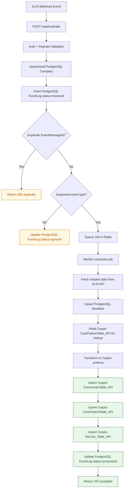

# Webhook to Caspio Data Flow

## Exact tables/models used

- PostgreSQL reads/writes:
  - `Company` (upsert/read by `companyKey`)
  - `EventLog` (insert `received`, update `queued|processed|ignored|failed`)
  - `Resident` (upsert by `alisResidentId`)
- Caspio reads/writes:
  - `CarePatientTable_API` via `CASPIO_TABLE_NAME` (lookup + upsert)
  - `CommunityTable_API` via `CASPIO_COMMUNITY_TABLE_NAME` (upsert)
  - `Service_Table_API` via `CASPIO_SERVICE_TABLE_NAME` (upsert)
- Table names above are the current defaults and can be overridden by env vars.
