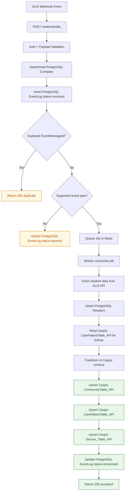

# Webhook to Caspio Data Flow

## Exact tables/models used

- PostgreSQL reads/writes:
  - `Company` (upsert/read by `companyKey`)
  - `EventLog` (insert `received`, update `queued|processed|ignored|failed`)
  - `Resident` (upsert by `alisResidentId`)
- Caspio reads/writes:
  - `CarePatientTable_API` via `CASPIO_TABLE_NAME` (lookup + upsert)
  - `CommunityTable_API` via `CASPIO_COMMUNITY_TABLE_NAME` (upsert)
  - `Service_Table_API` via `CASPIO_SERVICE_TABLE_NAME` (upsert)
- Table names above are the current defaults and can be overridden by env vars.

## Detailed data flow (written)

1. ALIS sends an HTTP POST event to `POST /webhook/alis`.
2. The webhook route applies request auth and parses payload shape.
3. The handler upserts `Company` using `CompanyKey`, then checks `EventLog` by `eventMessageId`.
4. If the event already exists, the request exits with `200` and no additional writes are performed.
5. If it is new, a row is inserted into `EventLog` with:
   - `companyId`, `communityId`, `eventType`, `eventMessageId`
   - full raw payload in `payload`
   - status set to `received`
6. Unsupported event types are marked in `EventLog` as `ignored` and return `202`.
7. `test.event` payloads are marked in `EventLog` as `ignored` (`Test event acknowledged`) and return `202`.
8. Supported non-test events are enqueued to BullMQ (`PROCESS_ALIS_EVENT_QUEUE`), then `EventLog.status` is updated to `queued`.
9. Worker `processAlisEvent` consumes the job and validates it has a usable resident identifier.
10. The worker resolves ALIS credentials for the company and calls ALIS APIs to retrieve resident details/basic info (and leave data when event type requires it).
11. Resident data is normalized and upserted to PostgreSQL `Resident` using `alisResidentId`.
12. Before Caspio writes, lookup logic may read from `CarePatientTable_API` (patient lookup by `PatientNumber`, and optionally `CUID`) to determine update path.
13. Caspio payload mapping produces:
    - community record shape
    - patient record shape
    - service record shape
14. Caspio writes occur through upserts in this order:
    - `CommunityTable_API` (by `CommunityID`)
    - `CarePatientTable_API` (by `PatientNumber` and optionally `CUID`)
    - `Service_Table_API` (by `Service_ID`)
15. On successful worker completion, `EventLog` is updated to:
    - `status = processed`
    - `processedAt = <timestamp>`
    - `error = null`
16. If processing fails before completion, `EventLog` is updated to `failed` with truncated error text.
17. Webhook caller receives asynchronous acknowledgement (`202 queued`) once the job is enqueued; downstream Caspio synchronization completes in the worker after the HTTP response.
